```python
import pandas as pd
import numpy as np
import matplotlib.pyplot as plt
import seaborn as sns
# plt.style.use('dark_background')
```

## Reading the data


```python
df = pd.read_csv('../dic-project/data/zomato.csv')
df.head()
```


<div>
<style scoped>
    .dataframe tbody tr th:only-of-type {
        vertical-align: middle;
    }

    .dataframe tbody tr th {
        vertical-align: top;
    }

    .dataframe thead th {
        text-align: right;
    }
</style>
<table border="1" class="dataframe">
  <thead>
    <tr style="text-align: right;">
      <th></th>
      <th>url</th>
      <th>address</th>
      <th>name</th>
      <th>online_order</th>
      <th>book_table</th>
      <th>rate</th>
      <th>votes</th>
      <th>phone</th>
      <th>location</th>
      <th>rest_type</th>
      <th>dish_liked</th>
      <th>cuisines</th>
      <th>approx_cost(for two people)</th>
      <th>reviews_list</th>
      <th>menu_item</th>
      <th>listed_in(type)</th>
      <th>listed_in(city)</th>
    </tr>
  </thead>
  <tbody>
    <tr>
      <th>0</th>
      <td>https://www.zomato.com/bangalore/jalsa-banasha...</td>
      <td>942, 21st Main Road, 2nd Stage, Banashankari, ...</td>
      <td>Jalsa</td>
      <td>Yes</td>
      <td>Yes</td>
      <td>4.1/5</td>
      <td>775</td>
      <td>080 42297555\r\n+91 9743772233</td>
      <td>Banashankari</td>
      <td>Casual Dining</td>
      <td>Pasta, Lunch Buffet, Masala Papad, Paneer Laja...</td>
      <td>North Indian, Mughlai, Chinese</td>
      <td>800</td>
      <td>[('Rated 4.0', 'RATED\n  A beautiful place to ...</td>
      <td>[]</td>
      <td>Buffet</td>
      <td>Banashankari</td>
    </tr>
    <tr>
      <th>1</th>
      <td>https://www.zomato.com/bangalore/spice-elephan...</td>
      <td>2nd Floor, 80 Feet Road, Near Big Bazaar, 6th ...</td>
      <td>Spice Elephant</td>
      <td>Yes</td>
      <td>No</td>
      <td>4.1/5</td>
      <td>787</td>
      <td>080 41714161</td>
      <td>Banashankari</td>
      <td>Casual Dining</td>
      <td>Momos, Lunch Buffet, Chocolate Nirvana, Thai G...</td>
      <td>Chinese, North Indian, Thai</td>
      <td>800</td>
      <td>[('Rated 4.0', 'RATED\n  Had been here for din...</td>
      <td>[]</td>
      <td>Buffet</td>
      <td>Banashankari</td>
    </tr>
    <tr>
      <th>2</th>
      <td>https://www.zomato.com/SanchurroBangalore?cont...</td>
      <td>1112, Next to KIMS Medical College, 17th Cross...</td>
      <td>San Churro Cafe</td>
      <td>Yes</td>
      <td>No</td>
      <td>3.8/5</td>
      <td>918</td>
      <td>+91 9663487993</td>
      <td>Banashankari</td>
      <td>Cafe, Casual Dining</td>
      <td>Churros, Cannelloni, Minestrone Soup, Hot Choc...</td>
      <td>Cafe, Mexican, Italian</td>
      <td>800</td>
      <td>[('Rated 3.0', "RATED\n  Ambience is not that ...</td>
      <td>[]</td>
      <td>Buffet</td>
      <td>Banashankari</td>
    </tr>
    <tr>
      <th>3</th>
      <td>https://www.zomato.com/bangalore/addhuri-udupi...</td>
      <td>1st Floor, Annakuteera, 3rd Stage, Banashankar...</td>
      <td>Addhuri Udupi Bhojana</td>
      <td>No</td>
      <td>No</td>
      <td>3.7/5</td>
      <td>88</td>
      <td>+91 9620009302</td>
      <td>Banashankari</td>
      <td>Quick Bites</td>
      <td>Masala Dosa</td>
      <td>South Indian, North Indian</td>
      <td>300</td>
      <td>[('Rated 4.0', "RATED\n  Great food and proper...</td>
      <td>[]</td>
      <td>Buffet</td>
      <td>Banashankari</td>
    </tr>
    <tr>
      <th>4</th>
      <td>https://www.zomato.com/bangalore/grand-village...</td>
      <td>10, 3rd Floor, Lakshmi Associates, Gandhi Baza...</td>
      <td>Grand Village</td>
      <td>No</td>
      <td>No</td>
      <td>3.8/5</td>
      <td>166</td>
      <td>+91 8026612447\r\n+91 9901210005</td>
      <td>Basavanagudi</td>
      <td>Casual Dining</td>
      <td>Panipuri, Gol Gappe</td>
      <td>North Indian, Rajasthani</td>
      <td>600</td>
      <td>[('Rated 4.0', 'RATED\n  Very good restaurant ...</td>
      <td>[]</td>
      <td>Buffet</td>
      <td>Banashankari</td>
    </tr>
  </tbody>
</table>
</div>


```python
df.shape
```


    (51717, 17)


```python
df.columns
```


    Index(['url', 'address', 'name', 'online_order', 'book_table', 'rate', 'votes',
           'phone', 'location', 'rest_type', 'dish_liked', 'cuisines',
           'approx_cost(for two people)', 'reviews_list', 'menu_item',
           'listed_in(type)', 'listed_in(city)'],
          dtype='object')


```python
df.info()
```

    <class 'pandas.core.frame.DataFrame'>
    RangeIndex: 51717 entries, 0 to 51716
    Data columns (total 17 columns):
     #   Column                       Non-Null Count  Dtype 
    ---  ------                       --------------  ----- 
     0   url                          51717 non-null  object
     1   address                      51717 non-null  object
     2   name                         51717 non-null  object
     3   online_order                 51717 non-null  object
     4   book_table                   51717 non-null  object
     5   rate                         43942 non-null  object
     6   votes                        51717 non-null  int64 
     7   phone                        50509 non-null  object
     8   location                     51696 non-null  object
     9   rest_type                    51490 non-null  object
     10  dish_liked                   23639 non-null  object
     11  cuisines                     51672 non-null  object
     12  approx_cost(for two people)  51371 non-null  object
     13  reviews_list                 51717 non-null  object
     14  menu_item                    51717 non-null  object
     15  listed_in(type)              51717 non-null  object
     16  listed_in(city)              51717 non-null  object
    dtypes: int64(1), object(16)
    memory usage: 6.7+ MB
    

## Cleaning

### 1)Removing unncessary columns

- url has name of restaurant and location. We also have a name column and location columns. so we can drop url
- review list has rating and customers reviews. we have a separate column for restaurant rating so we can drop review list column
- phone number column is also redundant for our project
- dishes liked is also not necessary for our predictions. we will base our predictions mainly on cusines, locatrion,rating.
- DECISION PENDING listed_in(city) has different locations. since we already have locations, listed_in(city) is redundant


```python
df = df.drop(['url', 'address', 'phone', 'menu_item', 'dish_liked', 'reviews_list'], axis = 1)
df.head()
```


<div>
<style scoped>
    .dataframe tbody tr th:only-of-type {
        vertical-align: middle;
    }

    .dataframe tbody tr th {
        vertical-align: top;
    }

    .dataframe thead th {
        text-align: right;
    }
</style>
<table border="1" class="dataframe">
  <thead>
    <tr style="text-align: right;">
      <th></th>
      <th>name</th>
      <th>online_order</th>
      <th>book_table</th>
      <th>rate</th>
      <th>votes</th>
      <th>location</th>
      <th>rest_type</th>
      <th>cuisines</th>
      <th>approx_cost(for two people)</th>
      <th>listed_in(type)</th>
      <th>listed_in(city)</th>
    </tr>
  </thead>
  <tbody>
    <tr>
      <th>0</th>
      <td>Jalsa</td>
      <td>Yes</td>
      <td>Yes</td>
      <td>4.1/5</td>
      <td>775</td>
      <td>Banashankari</td>
      <td>Casual Dining</td>
      <td>North Indian, Mughlai, Chinese</td>
      <td>800</td>
      <td>Buffet</td>
      <td>Banashankari</td>
    </tr>
    <tr>
      <th>1</th>
      <td>Spice Elephant</td>
      <td>Yes</td>
      <td>No</td>
      <td>4.1/5</td>
      <td>787</td>
      <td>Banashankari</td>
      <td>Casual Dining</td>
      <td>Chinese, North Indian, Thai</td>
      <td>800</td>
      <td>Buffet</td>
      <td>Banashankari</td>
    </tr>
    <tr>
      <th>2</th>
      <td>San Churro Cafe</td>
      <td>Yes</td>
      <td>No</td>
      <td>3.8/5</td>
      <td>918</td>
      <td>Banashankari</td>
      <td>Cafe, Casual Dining</td>
      <td>Cafe, Mexican, Italian</td>
      <td>800</td>
      <td>Buffet</td>
      <td>Banashankari</td>
    </tr>
    <tr>
      <th>3</th>
      <td>Addhuri Udupi Bhojana</td>
      <td>No</td>
      <td>No</td>
      <td>3.7/5</td>
      <td>88</td>
      <td>Banashankari</td>
      <td>Quick Bites</td>
      <td>South Indian, North Indian</td>
      <td>300</td>
      <td>Buffet</td>
      <td>Banashankari</td>
    </tr>
    <tr>
      <th>4</th>
      <td>Grand Village</td>
      <td>No</td>
      <td>No</td>
      <td>3.8/5</td>
      <td>166</td>
      <td>Basavanagudi</td>
      <td>Casual Dining</td>
      <td>North Indian, Rajasthani</td>
      <td>600</td>
      <td>Buffet</td>
      <td>Banashankari</td>
    </tr>
  </tbody>
</table>
</div>


### 2)changing columns names


```python
df.rename(columns={"approx_cost(for two people)":"cost","listed_in(type)":"type","listed_in(city)":"city"},inplace=True)
df.head()
```


<div>
<style scoped>
    .dataframe tbody tr th:only-of-type {
        vertical-align: middle;
    }

    .dataframe tbody tr th {
        vertical-align: top;
    }

    .dataframe thead th {
        text-align: right;
    }
</style>
<table border="1" class="dataframe">
  <thead>
    <tr style="text-align: right;">
      <th></th>
      <th>name</th>
      <th>online_order</th>
      <th>book_table</th>
      <th>rate</th>
      <th>votes</th>
      <th>location</th>
      <th>rest_type</th>
      <th>cuisines</th>
      <th>cost</th>
      <th>type</th>
      <th>city</th>
    </tr>
  </thead>
  <tbody>
    <tr>
      <th>0</th>
      <td>Jalsa</td>
      <td>Yes</td>
      <td>Yes</td>
      <td>4.1/5</td>
      <td>775</td>
      <td>Banashankari</td>
      <td>Casual Dining</td>
      <td>North Indian, Mughlai, Chinese</td>
      <td>800</td>
      <td>Buffet</td>
      <td>Banashankari</td>
    </tr>
    <tr>
      <th>1</th>
      <td>Spice Elephant</td>
      <td>Yes</td>
      <td>No</td>
      <td>4.1/5</td>
      <td>787</td>
      <td>Banashankari</td>
      <td>Casual Dining</td>
      <td>Chinese, North Indian, Thai</td>
      <td>800</td>
      <td>Buffet</td>
      <td>Banashankari</td>
    </tr>
    <tr>
      <th>2</th>
      <td>San Churro Cafe</td>
      <td>Yes</td>
      <td>No</td>
      <td>3.8/5</td>
      <td>918</td>
      <td>Banashankari</td>
      <td>Cafe, Casual Dining</td>
      <td>Cafe, Mexican, Italian</td>
      <td>800</td>
      <td>Buffet</td>
      <td>Banashankari</td>
    </tr>
    <tr>
      <th>3</th>
      <td>Addhuri Udupi Bhojana</td>
      <td>No</td>
      <td>No</td>
      <td>3.7/5</td>
      <td>88</td>
      <td>Banashankari</td>
      <td>Quick Bites</td>
      <td>South Indian, North Indian</td>
      <td>300</td>
      <td>Buffet</td>
      <td>Banashankari</td>
    </tr>
    <tr>
      <th>4</th>
      <td>Grand Village</td>
      <td>No</td>
      <td>No</td>
      <td>3.8/5</td>
      <td>166</td>
      <td>Basavanagudi</td>
      <td>Casual Dining</td>
      <td>North Indian, Rajasthani</td>
      <td>600</td>
      <td>Buffet</td>
      <td>Banashankari</td>
    </tr>
  </tbody>
</table>
</div>


### 3) removing duplicates


```python
df.drop_duplicates(inplace = True)
df.shape
```


    (51609, 11)


## 4) Removing null values


```python
df.dropna(inplace = True)
```

## 5)exploring rate column


```python
df['rate'].unique()
# if rating is NEW or - we assume its a new 
```


    array(['4.1/5', '3.8/5', '3.7/5', '3.6/5', '4.6/5', '4.0/5', '4.2/5',
           '3.9/5', '3.1/5', '3.0/5', '3.2/5', '3.3/5', '2.8/5', '4.4/5',
           '4.3/5', 'NEW', '2.9/5', '3.5/5', '2.6/5', '3.8 /5', '3.4/5',
           '4.5/5', '2.5/5', '2.7/5', '4.7/5', '2.4/5', '2.2/5', '2.3/5',
           '3.4 /5', '-', '3.6 /5', '4.8/5', '3.9 /5', '4.2 /5', '4.0 /5',
           '4.1 /5', '3.7 /5', '3.1 /5', '2.9 /5', '3.3 /5', '2.8 /5',
           '3.5 /5', '2.7 /5', '2.5 /5', '3.2 /5', '2.6 /5', '4.5 /5',
           '4.3 /5', '4.4 /5', '4.9/5', '2.1/5', '2.0/5', '1.8/5', '4.6 /5',
           '4.9 /5', '3.0 /5', '4.8 /5', '2.3 /5', '4.7 /5', '2.4 /5',
           '2.1 /5', '2.2 /5', '2.0 /5', '1.8 /5'], dtype=object)


- if rating is new or - we replcae it with null
- remove '/5' and converting to float


```python
def update_ratings(rating):
    if(rating=='NEW' or rating=='-'):
        return np.nan
    else:
        rating = str(rating).split('/')[0]
        return float(rating)
    
df['rate'] = df['rate'].apply(update_ratings)
df['rate'].unique()
```


    array([4.1, 3.8, 3.7, 3.6, 4.6, 4. , 4.2, 3.9, 3.1, 3. , 3.2, 3.3, 2.8,
           4.4, 4.3, nan, 2.9, 3.5, 2.6, 3.4, 4.5, 2.5, 2.7, 4.7, 2.4, 2.2,
           2.3, 4.8, 4.9, 2.1, 2. , 1.8])


## checking if all rates are within 0-5 
##### Outlier checking


```python
print(df['rate'].min())
print(df['rate'].max())
```

    1.8
    4.9
    

## 4) Removing null values


```python
df.dropna(inplace = True)
```

## 6)changing cost column to float data type

- cost is of object data type. We convert it to float, by removing commas


```python
df["cost"].unique()
```


    array(['800', '300', '600', '700', '550', '500', '450', '650', '400',
           '900', '200', '750', '150', '850', '100', '1,200', '350', '250',
           '950', '1,000', '1,500', '1,300', '199', '1,100', '1,600', '230',
           '130', '1,700', '1,350', '2,200', '1,400', '2,000', '1,800',
           '1,900', '180', '330', '2,500', '2,100', '3,000', '2,800', '3,400',
           '50', '40', '1,250', '3,500', '4,000', '2,400', '2,600', '1,450',
           '70', '3,200', '240', '6,000', '1,050', '2,300', '4,100', '120',
           '5,000', '3,700', '1,650', '2,700', '4,500', '80'], dtype=object)


```python
# replce comma with empty string in cost column
df["cost"]=df["cost"].astype(str).apply(lambda x: x.replace(",","")).astype(float)
df.info()
```

    <class 'pandas.core.frame.DataFrame'>
    Index: 41190 entries, 0 to 51716
    Data columns (total 11 columns):
     #   Column        Non-Null Count  Dtype  
    ---  ------        --------------  -----  
     0   name          41190 non-null  object 
     1   online_order  41190 non-null  object 
     2   book_table    41190 non-null  object 
     3   rate          41190 non-null  float64
     4   votes         41190 non-null  int64  
     5   location      41190 non-null  object 
     6   rest_type     41190 non-null  object 
     7   cuisines      41190 non-null  object 
     8   cost          41190 non-null  float64
     9   type          41190 non-null  object 
     10  city          41190 non-null  object 
    dtypes: float64(2), int64(1), object(8)
    memory usage: 3.8+ MB
    

## cheking for outliers in cost


```python


# Calculate the IQR (Interquartile Range)
Q1 = df['cost'].quantile(0.25)
Q3 = df['cost'].quantile(0.75)
IQR = Q3 - Q1

# Define lower and upper bounds to identify outliers
lower_bound = Q1 - 1.5 * IQR
upper_bound = Q3 + 1.5 * IQR

# Find outliers
outliers = df[(df['cost'] < lower_bound) | (df['cost'] > upper_bound)]


# Create a box plot to visualize the outliers
plt.figure(figsize=(8, 6))
plt.boxplot(df['cost'])
plt.title("Box Plot of Average Cost (with Outliers)")
plt.ylabel("Average Cost")
plt.xticks([1], ['Average Cost'])
plt.show()

```


    
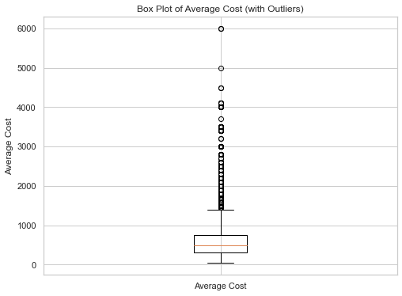
    


```python
print(df['cost'].min())
print(df['cost'].max())
```

    40.0
    6000.0
    

## 7) checking on location column


```python
location_counts=df['location'].value_counts()

```

##### If a particular location has less than 100 restaurant, we will change he location to 'others'


```python
def update_location(location):
    if location_counts[location]<300:
        return "others"
    else:
        return str(location)
    
df['location'] = df['location'].apply(update_location)
    
```

## 8) checking restaurant type (rest_type)


```python
rest_type_counts=df['rest_type'].value_counts()

```

##### If there are less than 100 restaurants of a particular type we will put that restaurant's rest_type as 'others'


```python
def update_rest_type(rest_type):
    if rest_type_counts[rest_type]<100:
        return "others"
    else:
        return str(rest_type)
    
df['rest_type'] = df['rest_type'].apply(update_rest_type)
```

## 9) Checking cuisines columns


```python
cuisines_count=df['cuisines'].value_counts()
print(cuisines_count)
```

    cuisines
    North Indian                                2107
    North Indian, Chinese                       1949
    South Indian                                1231
    Cafe                                         620
    Bakery, Desserts                             613
                                                ... 
    North Indian, Chinese, Oriya, Mithai           1
    Beverages, Burger                              1
    North Indian, Mughlai, Lucknowi                1
    Continental, Thai, North Indian, Chinese       1
    North Indian, Chinese, Arabian, Momos          1
    Name: count, Length: 2367, dtype: int64
    

##### if a particular cuisine type has less than 100 restaurant, then we change the cuisine type as others


```python
def update_cuisines(cuisine):
    if cuisines_count[cuisine]<100:
        return "others"
    
    else:
        return str(cuisine)
    
df['cuisines']=df['cuisines'].apply(update_cuisines)
```

# EDA


```python
df.head()
```


<div>
<style scoped>
    .dataframe tbody tr th:only-of-type {
        vertical-align: middle;
    }

    .dataframe tbody tr th {
        vertical-align: top;
    }

    .dataframe thead th {
        text-align: right;
    }
</style>
<table border="1" class="dataframe">
  <thead>
    <tr style="text-align: right;">
      <th></th>
      <th>name</th>
      <th>online_order</th>
      <th>book_table</th>
      <th>rate</th>
      <th>votes</th>
      <th>location</th>
      <th>rest_type</th>
      <th>cuisines</th>
      <th>cost</th>
      <th>type</th>
      <th>city</th>
    </tr>
  </thead>
  <tbody>
    <tr>
      <th>0</th>
      <td>Jalsa</td>
      <td>Yes</td>
      <td>Yes</td>
      <td>4.1</td>
      <td>775</td>
      <td>Banashankari</td>
      <td>Casual Dining</td>
      <td>others</td>
      <td>800.0</td>
      <td>Buffet</td>
      <td>Banashankari</td>
    </tr>
    <tr>
      <th>1</th>
      <td>Spice Elephant</td>
      <td>Yes</td>
      <td>No</td>
      <td>4.1</td>
      <td>787</td>
      <td>Banashankari</td>
      <td>Casual Dining</td>
      <td>others</td>
      <td>800.0</td>
      <td>Buffet</td>
      <td>Banashankari</td>
    </tr>
    <tr>
      <th>2</th>
      <td>San Churro Cafe</td>
      <td>Yes</td>
      <td>No</td>
      <td>3.8</td>
      <td>918</td>
      <td>Banashankari</td>
      <td>Cafe, Casual Dining</td>
      <td>others</td>
      <td>800.0</td>
      <td>Buffet</td>
      <td>Banashankari</td>
    </tr>
    <tr>
      <th>3</th>
      <td>Addhuri Udupi Bhojana</td>
      <td>No</td>
      <td>No</td>
      <td>3.7</td>
      <td>88</td>
      <td>Banashankari</td>
      <td>Quick Bites</td>
      <td>South Indian, North Indian</td>
      <td>300.0</td>
      <td>Buffet</td>
      <td>Banashankari</td>
    </tr>
    <tr>
      <th>4</th>
      <td>Grand Village</td>
      <td>No</td>
      <td>No</td>
      <td>3.8</td>
      <td>166</td>
      <td>Basavanagudi</td>
      <td>Casual Dining</td>
      <td>others</td>
      <td>600.0</td>
      <td>Buffet</td>
      <td>Banashankari</td>
    </tr>
  </tbody>
</table>
</div>


## 1)Count plot of various locations


```python
# Create a count plot
plt.figure(figsize = (16,10))
# plt.style.use('dark_background')
sns.countplot(x=df['location'], palette="Set1",order=df['location'].value_counts().index)

# Set labels and title

plt.xlabel("Locations")
plt.ylabel("# of restaurants")
plt.title("Locations Count Plot")
plt.xticks(rotation=90)

# Show the plot

plt.show()
```

    C:\Temp\ipykernel_27544\1595557934.py:4: FutureWarning: 
    
    Passing `palette` without assigning `hue` is deprecated and will be removed in v0.14.0. Assign the `x` variable to `hue` and set `legend=False` for the same effect.
    
      sns.countplot(x=df['location'], palette="Set1",order=df['location'].value_counts().index)
    


    
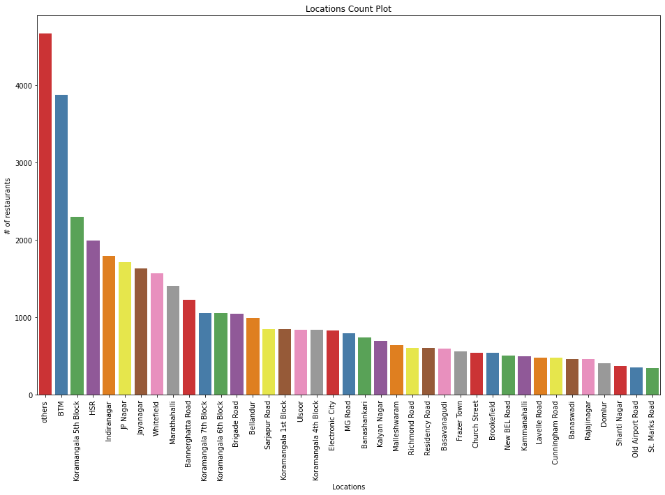
    


## 2)count plot of cuisine type


```python
# Exclude a cuisines category others 
cuisines_data=df['cuisines']
filtered_cuisines_data = cuisines_data[cuisines_data != "others"]


# Create a count plot
plt.figure(figsize = (16,10))
sns.countplot(x=filtered_cuisines_data, palette="Set1",order=filtered_cuisines_data.value_counts().index)

# Set labels and title
plt.xlabel("Cuisine")
plt.ylabel("# of restaurants")
plt.title("Cuisine  Count Plot")
plt.xticks(rotation=90)

# # Show the plot
# plt.style.use('dark_background')
plt.show()
```

    C:\Temp\ipykernel_27544\2953118006.py:8: FutureWarning: 
    
    Passing `palette` without assigning `hue` is deprecated and will be removed in v0.14.0. Assign the `x` variable to `hue` and set `legend=False` for the same effect.
    
      sns.countplot(x=filtered_cuisines_data, palette="Set1",order=filtered_cuisines_data.value_counts().index)
    


    
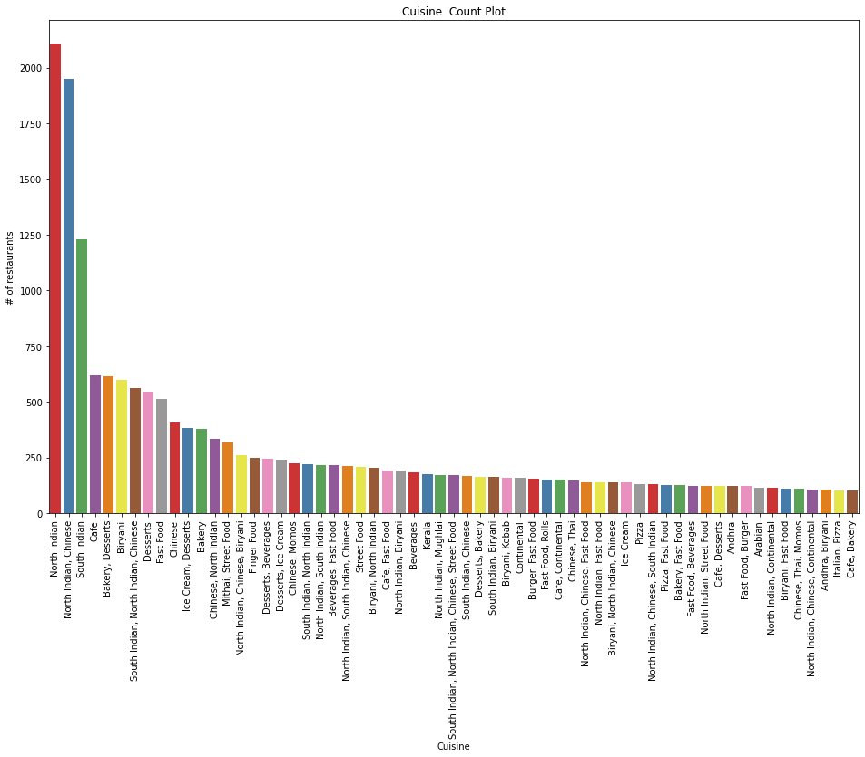
    


## 3) Count plot of online_order


```python
# Create a count plot
plt.figure(figsize = (6,5))
sns.countplot(data=df,x='online_order',palette="Set2" )

# Set labels and title
plt.xlabel("Online order")
plt.ylabel("# of restaurants")
plt.title("Online Order Count Plot")

# Show the plot
plt.show()
```

    C:\Temp\ipykernel_27544\1421130603.py:3: FutureWarning: 
    
    Passing `palette` without assigning `hue` is deprecated and will be removed in v0.14.0. Assign the `x` variable to `hue` and set `legend=False` for the same effect.
    
      sns.countplot(data=df,x='online_order',palette="Set2" )
    


    
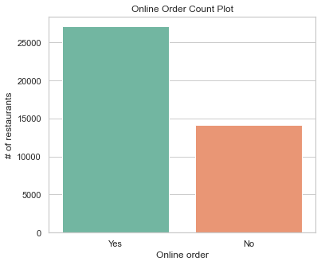
    


## pie plot of online orders


```python
# Calculate the counts of each category
counts = df['online_order'].value_counts()

# Create a pie chart
plt.figure(figsize=(6, 5))
plt.pie(counts, labels=counts.index, autopct='%1.1f%%', colors=['lightblue', 'lightcoral'])
plt.title("Online Order Pie Chart")
```


    Text(0.5, 1.0, 'Online Order Pie Chart')


    
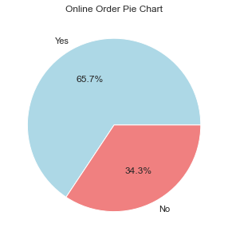
    


## 4) Count plot of book_table


```python
# Create a count plot
plt.figure(figsize = (6,5))
sns.countplot(x=df['book_table'], palette="Set2")

# Set labels and title
plt.xlabel("book_table")
plt.ylabel("# of restaurants")
plt.title("book_table Count Plot")

# Show the plot
plt.show()
```

    C:\Temp\ipykernel_27544\692090319.py:3: FutureWarning: 
    
    Passing `palette` without assigning `hue` is deprecated and will be removed in v0.14.0. Assign the `x` variable to `hue` and set `legend=False` for the same effect.
    
      sns.countplot(x=df['book_table'], palette="Set2")
    


    
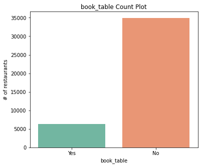
    


## 5) count plot of type


```python
# Create a count plot
plt.figure(figsize = (10,7))
sns.countplot(x=df['type'], palette="Set2")

# Set labels and title
plt.xlabel("type")
plt.ylabel("# of restaurants")
plt.title("type Count Plot")


# Show the plot
plt.show()
```

    C:\Temp\ipykernel_27544\607995992.py:3: FutureWarning: 
    
    Passing `palette` without assigning `hue` is deprecated and will be removed in v0.14.0. Assign the `x` variable to `hue` and set `legend=False` for the same effect.
    
      sns.countplot(x=df['type'], palette="Set2")
    


    
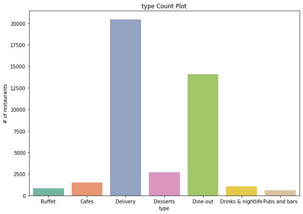
    


## Rate vs type


```python
plt.figure(figsize = (14, 8))
sns.boxplot(x = 'type', y = 'rate', data = df)
plt.title('Rate vs type')
plt.show()
```


    
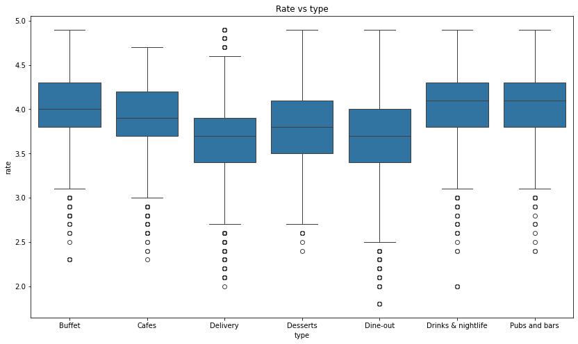
    


## 6)Rate vs online order


```python
plt.figure(figsize = (8,8))
sns.set(style="whitegrid")
sns.boxplot(x = df['online_order'], y = df['rate'],palette="Set2")

# medians = df.groupby('online_order')['rate'].mean()
# print(medians)
# for xtick, median in enumerate(medians):
#     plt.text(xtick, median, f'Median: {median:.2f}', horizontalalignment='center', color='black', weight='semibold')


plt.title("rate vs online order Plot")
plt.show()
```

    C:\Temp\ipykernel_27544\182898.py:3: FutureWarning: 
    
    Passing `palette` without assigning `hue` is deprecated and will be removed in v0.14.0. Assign the `x` variable to `hue` and set `legend=False` for the same effect.
    
      sns.boxplot(x = df['online_order'], y = df['rate'],palette="Set2")
    


    
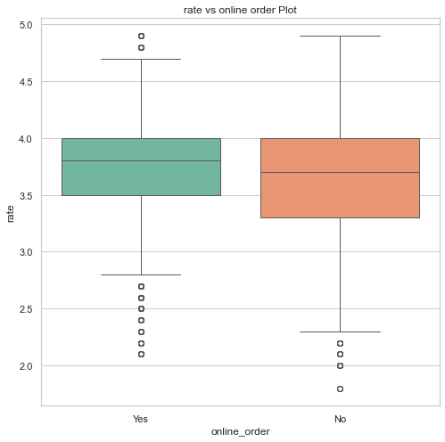
    


## 7)Rate vs book_table


```python
plt.figure(figsize = (8,8))
sns.set(style="whitegrid")
sns.boxplot(x = df['book_table'], y = df['rate'],palette="Set2")

# medians = df.groupby('book_table')['rate'].mean()
# print(medians)
# for xtick, median in enumerate(medians):
#     plt.text(xtick, median, f'Median: {median:.2f}', horizontalalignment='center', color='black', weight='semibold')

plt.title("rate vs book_table Plot")
```

    C:\Temp\ipykernel_27544\523843544.py:3: FutureWarning: 
    
    Passing `palette` without assigning `hue` is deprecated and will be removed in v0.14.0. Assign the `x` variable to `hue` and set `legend=False` for the same effect.
    
      sns.boxplot(x = df['book_table'], y = df['rate'],palette="Set2")
    


    Text(0.5, 1.0, 'rate vs book_table Plot')


    
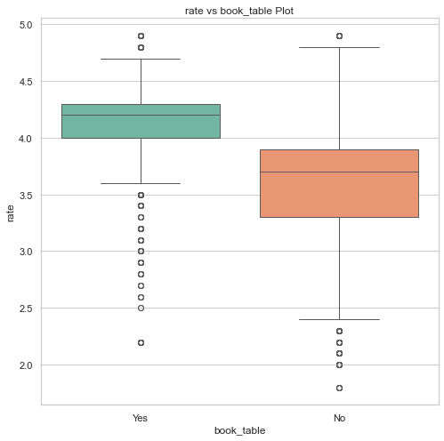
    


## 8) Count of restaurants based on location and online order


```python
# # Create a pivot table
# df1 = df.pivot_table(index='location', columns='online_order', values='name', aggfunc='count', fill_value=0)

# # Plot the bar chart
# df1.plot(kind='bar', figsize=(20, 8))
# plt.title("Count of Restaurants by Location and Online Order")
# plt.xlabel("Location")
# plt.ylabel("Count of Restaurants")
# plt.show()
```


```python
plt.figure(figsize = (25, 8))
sns.barplot(x = 'location', y = 'cost',hue='online_order', data = df,palette='Set2')

plt.title("Count of Restaurants by Location and Online Order")
plt.xlabel("Location")
plt.ylabel("Count of Restaurants")
plt.xticks(rotation = 90)
plt.show()
```


    
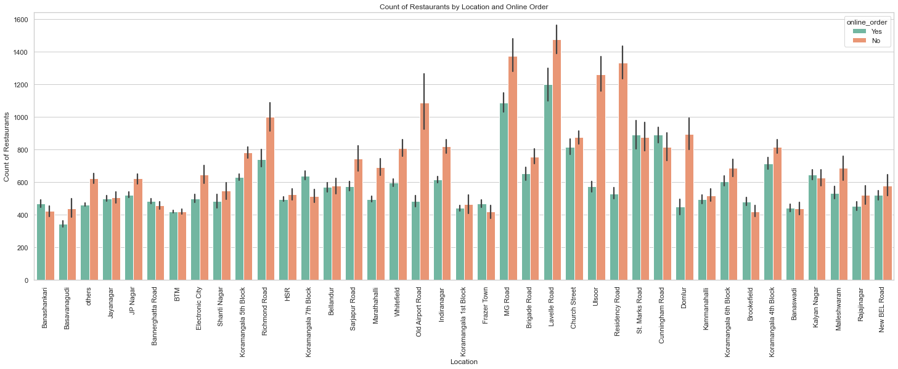
    


## 9) avg rating of restaraunts based on location and online order


```python
# Create a pivot table
df1 = df.pivot_table(index='location', columns='online_order', values='rate', aggfunc='mean', fill_value=0)
# print(df1)

# Plot the bar chart
ax=df1.plot(kind='bar', figsize=(20, 8))
plt.title("average rating of Restaurants by Location and Online Order")
plt.xlabel("Location")
plt.ylabel("avg. rating of Restaurants")
ax.set_ylim(3.25, 4.3)
plt.show()
```


    
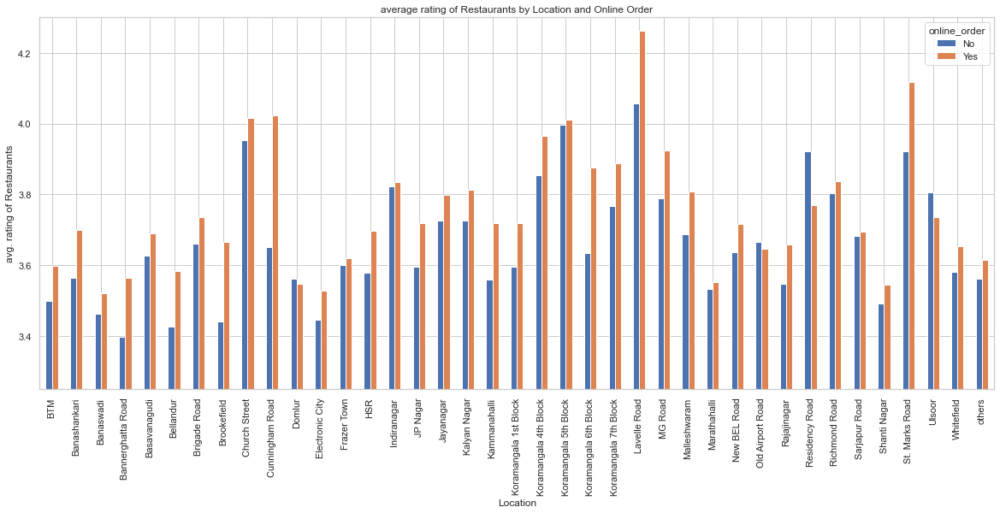
    


## 10) location vs cost


```python
plt.figure(figsize = (14, 8))
sns.barplot(x = 'location', y = 'cost', data = df)

plt.title('cost vs location')
plt.xticks(rotation = 90)
plt.show()
```


    
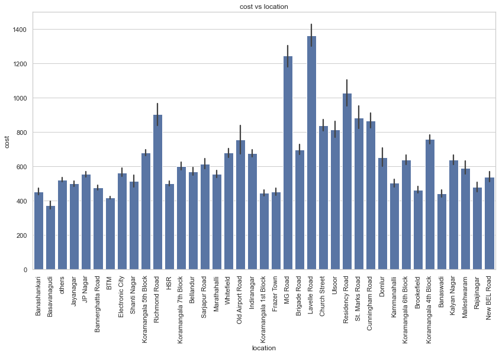
    


```python
# alternate version of same

avg_cost_by_category = df.groupby('location')['cost'].mean().reset_index()

# Create a bar plot
plt.figure(figsize=(10, 6))
plt.bar(avg_cost_by_category['location'], avg_cost_by_category['cost'], color='skyblue')
plt.title("Average Cost by Restaurant Category")
plt.xlabel("Category")
plt.ylabel("Average Cost")
plt.xticks(rotation=90)  # Rotate x-axis labels for better readability

# Show the plot
plt.show()
```


    
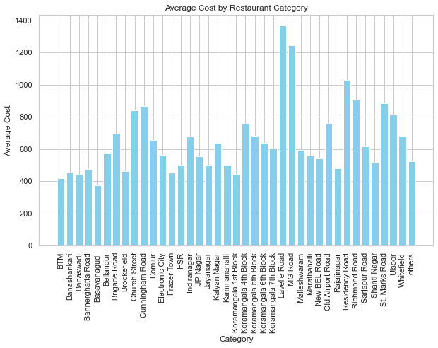
    


## 11)displot for rating


```python
plt.figure(figsize=(8, 8))
plt.hist(df['rate'], bins=df['rate'].nunique(), color='skyblue', edgecolor='black', alpha=0.7)
plt.title("Distribution of ratings")
plt.xlabel("rating")
plt.ylabel("Frequency")

# Show the plot
plt.show()
```


    
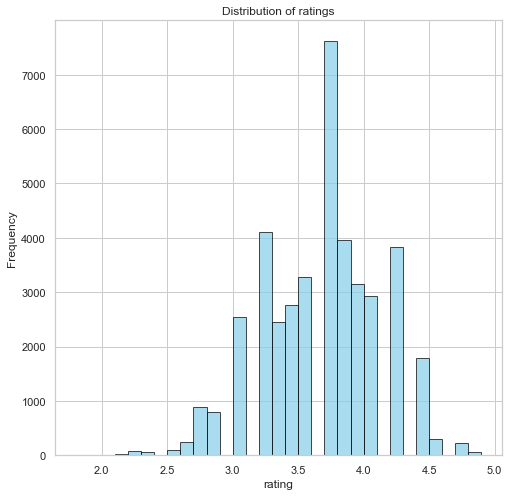
    


## treemap of number of restaurants in each location


```python
import squarify

count_of_rest_in_location =df.groupby('location')[['name']].count().reset_index().name.values.tolist()

list_of_locations=df.groupby('location')[['name']].count().index.tolist()

list_label=[location+"\n "+str(count_of_rest) for location,count_of_rest in zip(list_of_locations,count_of_rest_in_location)]
# int_list = [int(item) for item in count_of_rest_in_location]
plt.figure()
plt.figure(figsize=(15, 15))
squarify.plot(sizes=count_of_rest_in_location, label=list_label, alpha=.9)
plt.show()
```


    <Figure size 432x288 with 0 Axes>


    
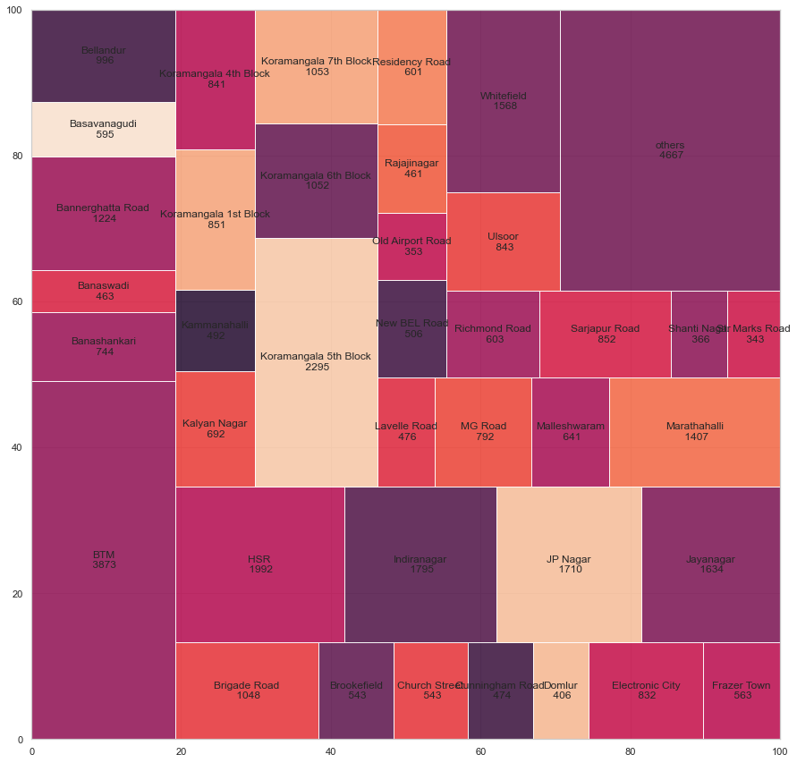
    


# dummy


```python


# Calculate the IQR (Interquartile Range)
Q1 = df['cost'].quantile(0.25)
Q3 = df['cost'].quantile(0.75)
IQR = Q3 - Q1

# Define lower and upper bounds to identify outliers
lower_bound = Q1 - 1.5 * IQR
upper_bound = Q3 + 1.5 * IQR

# Find outliers
outliers = df[(df['cost'] < lower_bound) | (df['cost'] > upper_bound)]


# Create a box plot to visualize the outliers
plt.figure(figsize=(8, 6))
plt.boxplot(df['cost'])
plt.title("Box Plot of Average Cost (with Outliers)")
plt.ylabel("Average Cost")
plt.xticks([1], ['Average Cost'])
plt.show()

```


    

    


```python
min_value = df['cost'].min()
max_value = df['cost'].max()

print(min_value)

print(max_value)
```

    40.0
    6000.0
    


```python


# Calculate the IQR (Interquartile Range)
Q1 = df['rate'].quantile(0.25)
Q3 = df['rate'].quantile(0.75)
IQR = Q3 - Q1

# Define lower and upper bounds to identify outliers
lower_bound = 0
upper_bound = 5

# Find outliers
outliers = df[(df['rate'] < lower_bound) | (df['rate'] > upper_bound)]

# Print the outliers
print("Outliers:")
print(outliers['rate'])

# Create a box plot to visualize the outliers
plt.figure(figsize=(8, 6))
plt.boxplot(df['rate'])
plt.title("Box Plot of Average Cost (with Outliers)")
plt.ylabel("Average Cost")
plt.xticks([1], ['Average Cost'])
plt.show()

```

    Outliers:
    Series([], Name: rate, dtype: float64)
    


    
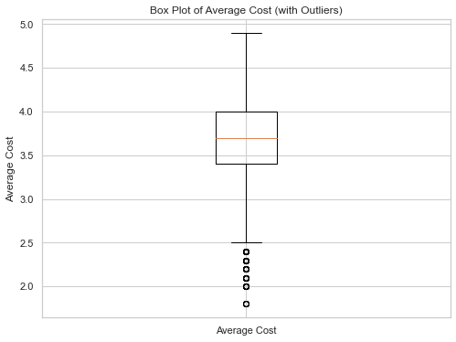
    


```python

sns.heatmap(df.corr(), annot=True)
plt.show()


```


    Running cells with 'c:\Users\Nitin Dharmapal\AppData\Local\Microsoft\WindowsApps\python3.8.exe' requires the ipykernel package.
    

    Run the following command to install 'ipykernel' into the Python environment. 
    

    Command: '"c:/Users/Nitin Dharmapal/AppData/Local/Microsoft/WindowsApps/python3.8.exe" -m pip install ipykernel -U --user --force-reinstall'

